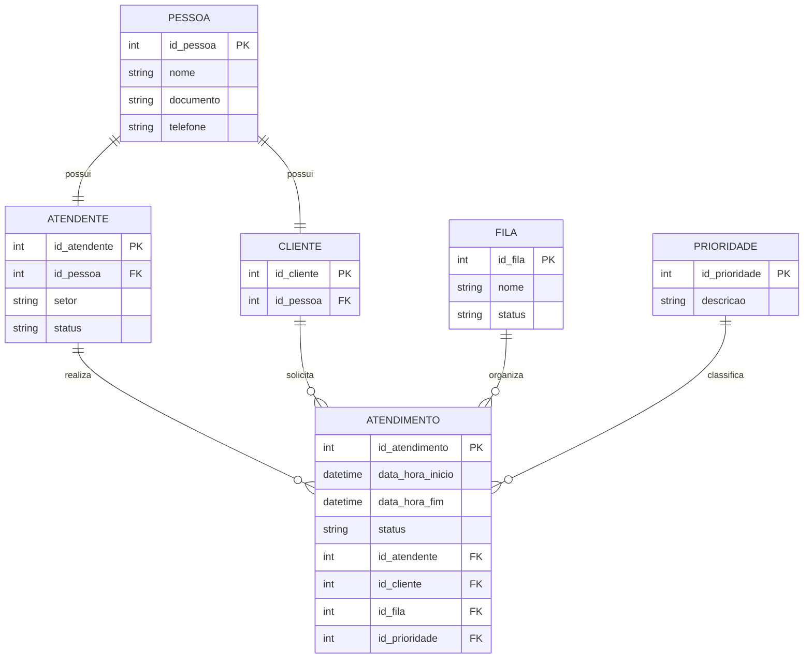

# Aplicativo-de-registro-de-atendimento

## Sobre o Projeto

Este projeto apresenta um modelo inicial de banco de dados para um aplicativo de registro de atendimento. A proposta é ajudar empresas a organizarem o atendimento ao público, permitindo o cadastro de atendentes, clientes, filas e o registro dos atendimentos realizados.

## Objetivo

O objetivo principal é estruturar um banco de dados relacional que sirva como base para o desenvolvimento futuro do sistema, facilitando o controle e a organização dos atendimentos.

## Público-Alvo

Empresas ou organizações que realizam atendimento ao público e precisam de um controle simples e eficiente de filas e atendimentos.

## Estrutura Inicial

Nesta etapa, o projeto contempla apenas a modelagem inicial do banco de dados, com a definição das principais tabelas e seus relacionamentos, sem aprofundar em regras de negócio ou funcionalidades avançadas.

## Modelo de Dados

O modelo de dados foi desenvolvido utilizando o diagrama ER em formato MERMAID, representando as entidades principais do sistema e seus relacionamentos.

