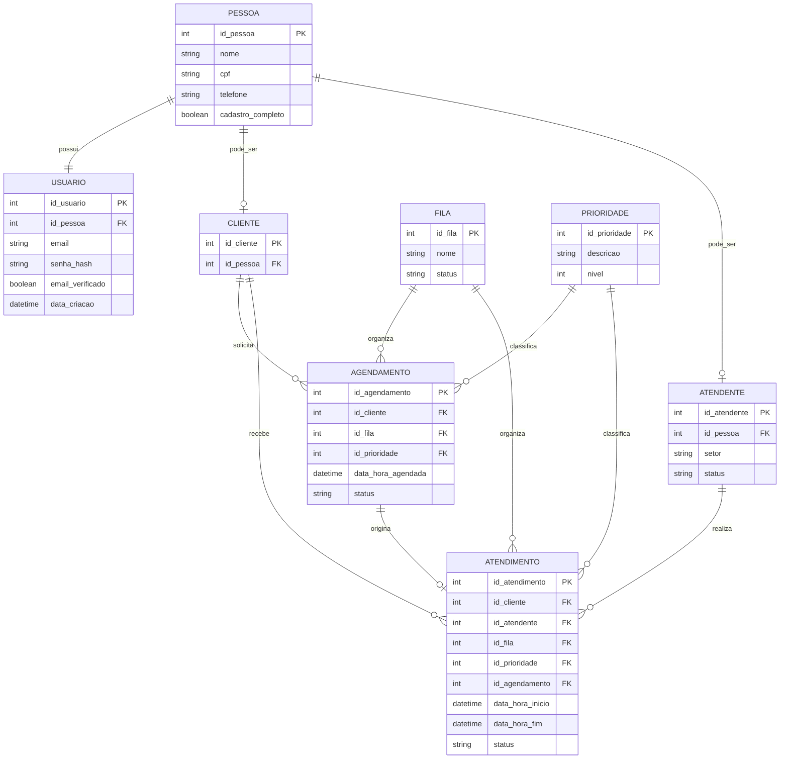

# Aplicativo de Registro de Atendimento

## Sobre o Projeto

Este projeto apresenta um modelo de banco de dados para um sistema de gerenciamento de atendimentos com cadastro seguro, agendamento prévio e controle de filas. A proposta é permitir que organizações organizem o atendimento ao público de forma estruturada, evitando duplicidade de usuários e mantendo controle sobre prioridades e histórico de atendimentos.

O sistema foi projetado com foco em segurança no cadastro, organização de horários e flexibilidade de papéis, permitindo que uma mesma pessoa atue como cliente, atendente ou ambos.

---

## Objetivo

Estruturar um banco de dados relacional que sirva como base para o desenvolvimento de um sistema de agendamento e registro de atendimentos, contemplando:

* Cadastro seguro de usuários
* Evitar duplicidade de pessoas
* Agendamento por data e horário
* Controle de fila única com prioridades
* Registro completo dos atendimentos realizados

---

## Fluxo do Sistema

O sistema segue o seguinte fluxo de utilização:

### 1. Cadastro Inicial

O usuário realiza um cadastro simples informando:

* Email
* Senha

### 2. Verificação de Email

* Um código de verificação é enviado para o email informado
* O usuário deve confirmar o código
* Um captcha é utilizado para validação anti-robô

Após a confirmação, o acesso ao sistema é liberado.

### 3. Completar Cadastro

Dentro do sistema, o usuário informa seus dados pessoais, como:

* Nome
* CPF ou documento
* Telefone

Essas informações são armazenadas na entidade **Pessoa**.

### 4. Definição de Perfil

A mesma pessoa pode assumir um ou mais papéis:

* Cliente
* Atendente

Isso evita duplicidade de dados e permite maior flexibilidade no sistema.

### 5. Agendamento

O cliente seleciona:

* Data disponível
* Horário disponível

O agendamento é registrado e vinculado a um horário específico.

### 6. Atendimento

No momento do atendimento:

* Um atendente realiza o serviço
* O atendimento é registrado no sistema
* Pode ser definida uma prioridade para organização da fila

---

## Modelo de Usuários

O sistema utiliza uma estrutura centralizada:

* **Pessoa**: armazena os dados principais
* **Cliente**: identifica a pessoa como solicitante de atendimento
* **Atendente**: identifica a pessoa como responsável pelo atendimento

Uma mesma pessoa pode ser cliente e atendente simultaneamente.

---

## Controle de Fila

* O sistema utiliza **fila única**
* Cada atendimento pode possuir um nível de **prioridade**
* A organização da fila considera:

  * Data e horário do agendamento
  * Nível de prioridade

---

## Estrutura do Banco de Dados

O modelo foi desenvolvido utilizando diagrama ER em formato **MERMAID**, contendo as seguintes entidades principais:

* Account (conta de acesso)
* Verificação de Email
* Pessoa
* Cliente
* Atendente
* Fila
* Prioridade
* Horários disponíveis
* Agendamentos
* Atendimentos realizados

---

## Escopo do Projeto

Nesta etapa, o projeto contempla:

* Modelagem do banco de dados
* Estrutura de entidades e relacionamentos
* Definição do fluxo principal do sistema

Regras de negócio avançadas e implementação da aplicação não fazem parte do escopo atual.

