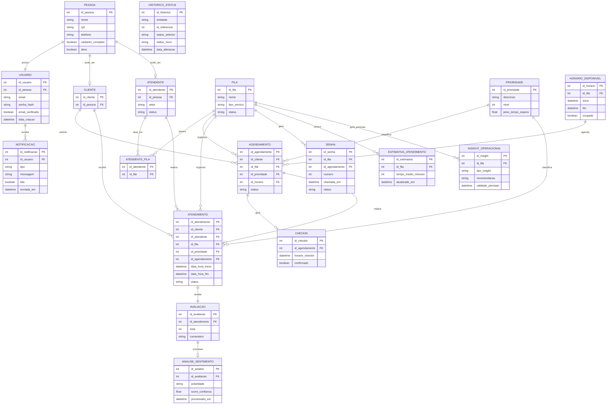

# SIGA - Sistema Inteligente de Gestão de Atendimento

## Sobre o Projeto

O **SIGA** é um sistema focado na modelagem de um banco de dados relacional para o gerenciamento completo de fluxos de atendimento. O projeto organiza desde o agendamento inicial até a conclusão do serviço, garantindo controle sobre filas, senhas e notificações.

A proposta evolui de um modelo básico para uma estrutura mais próxima de sistemas reais, incluindo controle de horários, check-in, geração de senhas e métricas de desempenho. Nesta etapa, o **SIGA** foi expandido com elementos de **Inteligência de Dados**, permitindo que o sistema gere insights operacionais automáticos.

---

## Inovação: Inteligência de Dados

O **SIGA** integra recursos avançados de análise de dados para otimizar a gestão:

* **Análise de Sentimento:** Processamento dos comentários de avaliações para identificar padrões de satisfação.
* **Predição de Demanda:** Tabelas dedicadas a armazenar insights sobre o fluxo de pessoas e sugestões de realocação de recursos.

---

## Protótipo de Interface

O desenvolvimento visual do **SIGA** foi realizado no Figma, contemplando as jornadas do cliente, atendente e gestor.

* **Link do Protótipo:** https://www.figma.com/make/1mYuBAJS46AKrzTsc7wb3F/Untitled?t=HnuZxSIGQdWzF8aV-20&fullscreen=1

---

## Objetivo

Desenvolver uma base de dados robusta capaz de suportar:

* Cadastro seguro de usuários
* Evitar duplicidade de pessoas
* Agendamento com controle de horários disponíveis
* Gerenciamento de filas com prioridade
* Registro completo dos atendimentos
* Avaliação de serviços prestados
* Geração de métricas e estimativas de atendimento com suporte a IA

---

## Funcionalidades

### Gestão de Usuários
* Cadastro com autenticação (email e senha)
* Verificação de email
* Associação com dados pessoais (Pessoa)
* Suporte a múltiplos papéis (Cliente e Atendente)

### Agendamento
* Seleção de fila de atendimento
* Escolha de horários disponíveis
* Controle de ocupação de horários
* Organização por prioridade

### Check-in
* Confirmação de presença antes do atendimento
* Controle de faltas (no-show)

### Atendimento
* Registro de início e fim do atendimento
* Associação com cliente e atendente
* Classificação por prioridade

### Fila em Tempo Real
* Geração de senhas
* Controle de chamadas
* Simulação de ambientes reais de atendimento

### Avaliação e Inteligência
* Avaliação do atendimento pelo cliente com registro de notas e comentários
* Análise de sentimento automatizada sobre os feedbacks recebidos
* Geração de insights operacionais e alertas de pico de demanda

### Notificações
* Envio de notificações para usuários
* Confirmações, lembretes e atualizações de status

### Métricas e Monitoramento
* Estimativa de tempo médio por fila
* Histórico de alterações de status
* Base para análise de desempenho preditiva

---

## Modelagem

O sistema utiliza uma estrutura centralizada baseada na entidade **Pessoa**, evitando duplicidade de dados. O diagrama de entidade-relacionamento detalhando as conexões entre usuários, atendimentos e os novos módulos de inteligência está disponível no arquivo de modelagem anexo.

*(Visualizar Diagrama ER no arquivo correspondente)*

---

## Estrutura do Banco

Principais entidades:

* Pessoa e Usuário
* Cliente e Atendente
* Fila e Prioridade
* Horário Disponível
* Agendamento e Atendimento
* Check-in e Senha
* Avaliação e Análise de Sentimento
* Insight Operacional
* Notificação
* Estimativa de Atendimento
* Histórico de Status

---

## Tecnologias

* **Modelagem:** Mermaid (ER Diagram)
* **Banco de Dados:** PostgreSQL
* **Prototipagem:** Figma
* **Ferramenta:** pgAdmin

---

## Status do Projeto

Estrutura concluída:
* Modelagem completa do banco de dados
* Implementação das tabelas de inovação (Inteligência de Dados)
* Protótipo de interface desenvolvido no Figma
* Pronto para testes no pgAdmin

---

## Observações

Este projeto possui caráter acadêmico, com foco no aprendizado de modelagem de dados, inovação tecnológica e simulação de sistemas reais.

